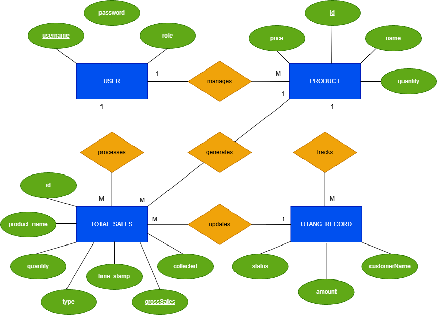

# 🏪 Sari-Sari Store Management System

A console-based Point of Sale (POS) and Inventory Management System built entirely in Java. Designed for local store owners to transition from manual pen-and-paper tracking to an efficient, SQLite-backed digital workflow.

## 🚀 Features Overview

* **Role-Based Access:** Secure login system separating Admin (full system analytics) and Cashier (sales processing).
* **Smart Inventory:** Easily add, restock, or remove products. The system automatically flags items running critically low on stock.
* **Quick Checkout Terminal:** A straightforward cashier interface seamlessly handling both "CASH" and "UTANG" transactions.
* **Digital Credit Ledger:** No more lost notebooks! Automatically tracks customer *utang* (credits), accepts partial or full payments, and computes exact change.
* **Automated Analytics:** Instantly generate financial reports detailing Total Gross Revenue, Direct Cash Sales, and Credit Collections.

## 📖 Documentation

For a deep dive into the system's architecture and database structure:
* **Physical ERD (`Sari-Sari Store System ERD.png`)** - The logical and physical database design mapping out the `users`, `products`, `total_sales`, and `utang_records` entities.
* **License (`LICENSE`)** - Full details of the MIT open-source license.

### Database Architecture


## 🛠️ Setup & Installation

This project uses standard Java libraries and requires a manual build setup via NetBeans.

### Prerequisites
* Java (JDK 8 or higher)
* NetBeans IDE 8.2 RC
* SQLite JDBC Driver & SLF4J (Included in the repository)

### Installation 

1. **Clone the repository:**
```bash
git clone https://github.com/Girlie-Gumalang/Sari-Sari-Store-System.git
